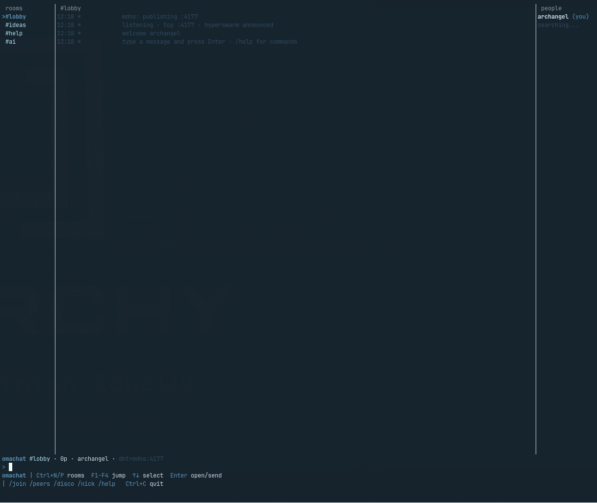

# Omachat

Peer-to-peer community chat for [Omarchy](https://omarchy.org) — **no chat server**.

Join a named room, find peers over Hyperswarm (global), Avahi mDNS (LAN), and/or Tailscale (shared tailnet), and chat in a three-pane TUI.



## How it works

| Layer | When it helps |
|-------|----------------|
| **Hyperswarm / HyperDHT** | Anywhere on the internet (UDP + holepunch) |
| **mDNS (Avahi)** | Same LAN — fast direct TCP |
| **Tailscale** | Shared tailnet — probes TCP **4177** |

Same room name = same topic. There is no Omarchy-operated chat server and no message history when you are offline.

## Requirements

- **Node.js ≥ 20**
- **gum** (launcher splash / nick picker)
- Optional: **Avahi** (`avahi-publish`, `avahi-browse`), **Tailscale**

## Install

```bash
git clone https://github.com/the4rchangel/omachat.git
cd omachat
npm install
install -Dm755 bin/omachat ~/.local/bin/omachat
mkdir -p ~/.local/share/applications
cp applications/Omachat.desktop ~/.local/share/applications/
update-desktop-database ~/.local/share/applications 2>/dev/null || true
```

On Omarchy, the desktop entry uses `omarchy-launch-or-focus-tui` so it shows up in the app menu like other TUIs.

## Run

```bash
omachat                 # gum splash → nick (first run) → #lobby
omachat ideas           # open #ideas
node src/cli.js --nick YourName lobby
```

Two local peers (separate identities):

```bash
node src/cli.js --nick Alice lobby
# other terminal:
OMACHAT_CONFIG=/tmp/omachat-bob OMACHAT_PORT=4178 node src/cli.js --nick Bob lobby
```

## Layout & keys

```
 rooms     │ #lobby              │ people
>#lobby    │ 01:12  alice  hi    │ alice (you)
 #ideas    │ 01:13  bob    yo    │ bob
 #help     │                     │
 #ai       │                     │
omachat #lobby · 1p · alice · dht+mdns:4177
> message here
```

| Key | Action |
|-----|--------|
| Type + **Enter** | Send message |
| **Enter** (empty) | Open highlighted room |
| **Ctrl+N** / **Ctrl+P** | Next / previous room |
| **F1**–**F4** | Jump lobby / ideas / help / ai |
| **↑** / **↓** | Move room highlight |
| `/join name` | Switch or create a room |
| `/peers` | List connected peers |
| `/disco` | Discovery status |
| `/nick` | Change nick |
| `/help` | Commands |
| **Ctrl+C** | Quit |

## Config & environment

```
~/.config/omachat/nick
~/.config/omachat/identity.seed   # keep private (mode 0600)
~/.config/omachat/tui-error.log   # only if the TUI throws
```

| Env | Meaning |
|-----|---------|
| `OMACHAT_CONFIG` | Override config directory |
| `OMACHAT_HOME` | Override install root (where `src/cli.js` lives) |
| `OMACHAT_PORT` | Direct listen port (default `4177`) |
| `OMACHAT_NO_MDNS=1` | Disable Avahi |
| `OMACHAT_NO_TAILSCALE=1` | Disable Tailscale probing |

## Security

- **No chat server.** Discovery uses public HyperDHT bootstraps; chat is peer-to-peer.
- **Hyperswarm** paths use Noise encryption.
- **Direct TCP** (mDNS / Tailscale) is cleartext JSON — intended for trusted LAN / tailnet.
- **Room name = invite** for v1. Anyone who knows the room name can join that topic.
- Do not commit or share `identity.seed`.
- Legacy Libera IRC launcher (if present): `bin/omachat-irc`.

## Tests

```bash
npm test                 # smoke (two Hyperswarm peers) + TUI key rules
npm run smoke
npm run keys
```

## Troubleshooting

### `omachat: command not found`

The launcher is not on your `PATH`.

```bash
install -Dm755 bin/omachat ~/.local/bin/omachat
# ensure ~/.local/bin is on PATH (Omarchy usually has this)
echo "$PATH" | tr ':' '\n' | grep -q "$HOME/.local/bin" || echo 'Add export PATH="$HOME/.local/bin:$PATH" to your shell rc'
```

### `Cannot find Omachat app`

The launcher cannot locate `src/cli.js`.

```bash
export OMACHAT_HOME=~/Projects/omachat   # or wherever you cloned
omachat
```

Or reinstall the launcher from that clone so it resolves relative to the repo.

### Window opens then immediately closes / blank terminal

Usually a Node crash. Run without the gum wrapper:

```bash
cd ~/path/to/omachat
node src/cli.js --nick TestUser lobby
```

Check:

```bash
node -v                    # need >= 20
cat ~/.config/omachat/tui-error.log 2>/dev/null
```

If `tui-error.log` exists, the stack trace there is the starting point.

### Typing does nothing / keys feel wrong

Fully quit (**Ctrl+C**) and relaunch — do not reuse a half-dead terminal session. Omachat uses raw mode; a previous crash can leave the terminal in a bad state:

```bash
reset
omachat
```

### Stuck at `0p` / `searching...` (no peers)

You are alone until another peer joins the **same room** with a working discovery path.

1. Confirm the other person is in the same room (`#lobby` vs `#ideas` are different topics).
2. Check discovery: type `/disco` in the TUI.
3. **Same machine test:** run a second peer with a different config and port (see [Run](#run)).
4. **LAN:** ensure Avahi is running (`systemctl status avahi-daemon`). Disable with `OMACHAT_NO_MDNS=1` if it misbehaves.
5. **Internet:** Hyperswarm needs outbound UDP. Corporate / captive portals often block DHT and holepunch — try from a normal home network.
6. **Tailscale:** both peers must be on the same tailnet; status should mention `ts` when probing works. Skip with `OMACHAT_NO_TAILSCALE=1` if Tailscale is installed but unused.
7. Wait 10–30 seconds after join; DHT announcements are not instant.

### Port already in use (`EADDRINUSE` / listen fails)

Something else is bound near **4177**.

```bash
OMACHAT_PORT=4180 omachat
# or
ss -ltnp | grep 4177
```

### Gum errors on launch

Install gum (Omarchy usually has it):

```bash
# Arch / Omarchy
omarchy pkg add gum   # or: pacman -S gum
```

You can always skip the launcher and run `node src/cli.js --nick YourName lobby`.

### Desktop entry does nothing

- Confirm `omachat` works in a terminal first.
- On non-Omarchy systems, edit `Exec=` in the `.desktop` file to call a terminal, e.g. `Exec=alacritty -e omachat`, or install Omarchy’s TUI launch helpers.
- Refresh: `update-desktop-database ~/.local/share/applications`

### `npm install` / native module build failures

Hyperswarm pulls native addons (`sodium-native`, `udx-native`). Install build tools:

```bash
# Arch
sudo pacman -S base-devel python
node -v   # >= 20
rm -rf node_modules && npm install
```

### Privacy checklist after a shared machine

```bash
ls -la ~/.config/omachat/
# identity.seed should be -rw------- (0600)
chmod 600 ~/.config/omachat/identity.seed 2>/dev/null
```

## Upstream (Omarchy)

Packaging into Omarchy itself is a separate process (Suggestion discussion, then a thin install/desktop PR). See [`UPSTREAM.md`](UPSTREAM.md).

## License

MIT
